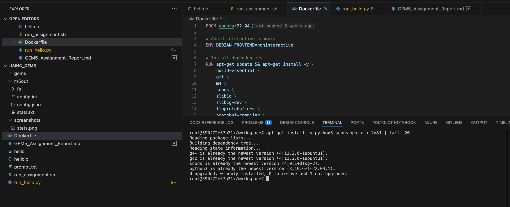
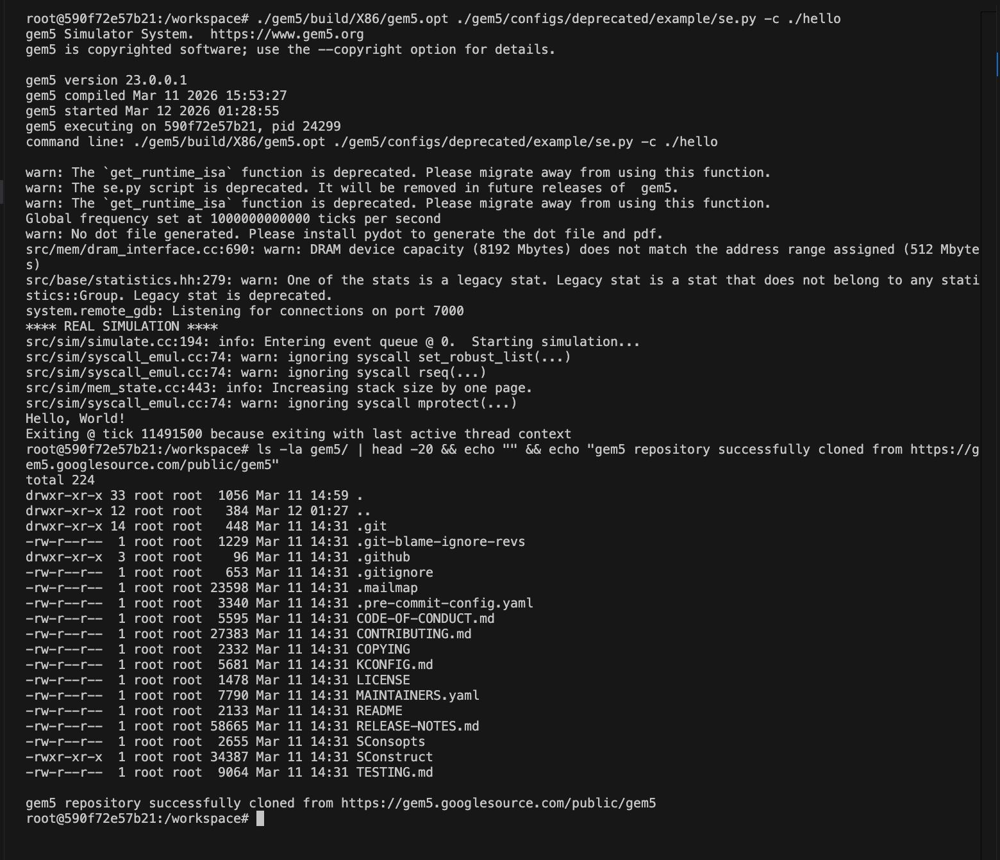
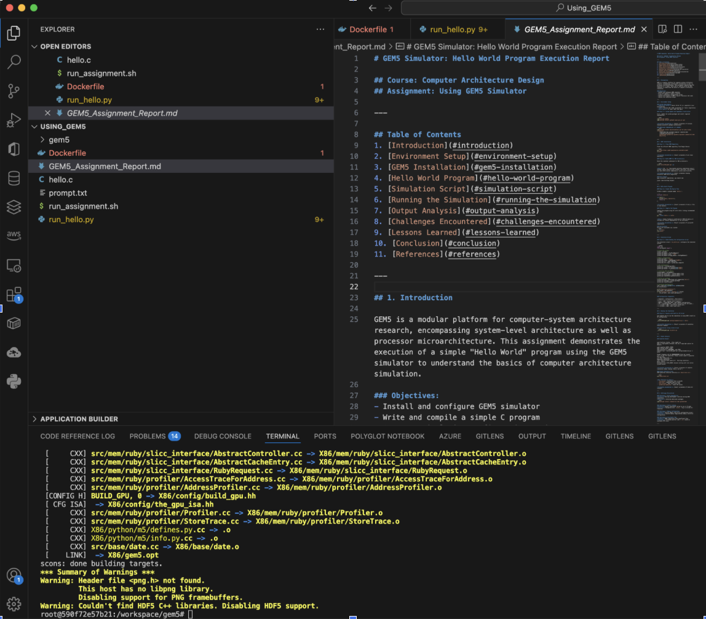
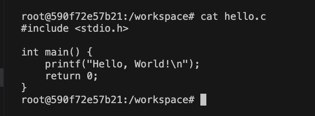
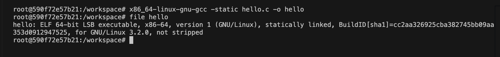
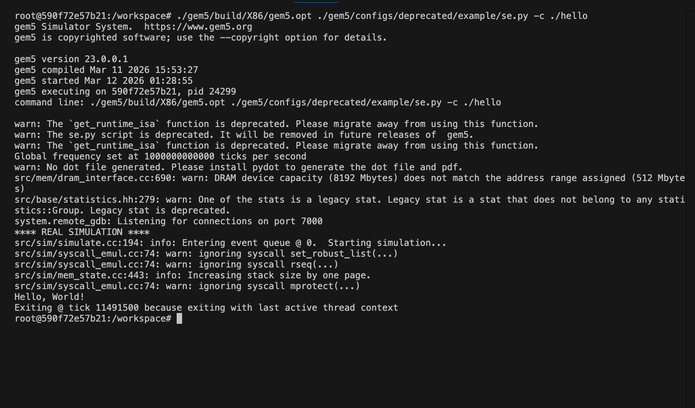
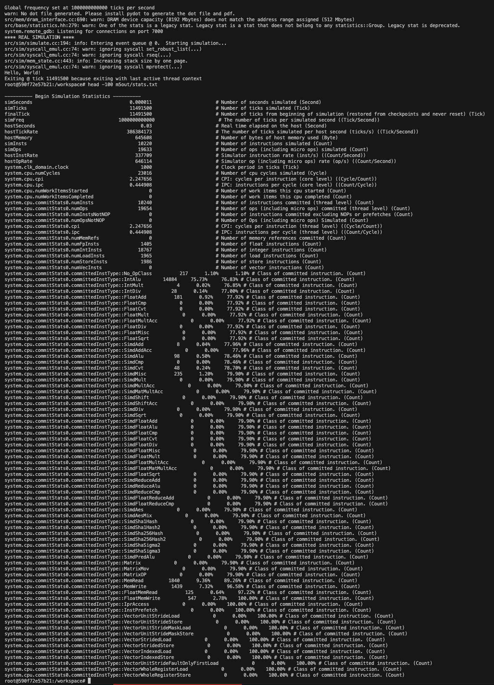

# GEM5 Simulator: Hello World Program Execution Report

---

**Course:** Computer Architecture Design  
**Assignment:** Using GEM5 Simulator  
**Student Name:** Sai Mohan Manukonda  
**Student ID:** 005046992  
**Instructor:** Professor Gary Perry  
**Institution:** University of the Cumberlands  
**Date:** March 12, 2026  

---

## Abstract

This report documents the installation, configuration, and execution of the GEM5 computer architecture simulator. The primary objective was to execute a simple "Hello World" C program within the GEM5 simulated X86 environment to understand the fundamentals of processor simulation. The assignment was completed using Docker containers on macOS to create a compatible Linux environment. Key challenges included cross-platform compatibility issues and architecture mismatches between the host ARM64 system and the simulated X86 target. The simulation successfully executed the program, completing in 11,491,500 ticks with 10,220 instructions. This exercise provided valuable insights into cycle-accurate simulation, memory hierarchy, and performance metrics analysis in computer architecture research.

**Keywords:** GEM5, computer architecture, simulation, X86, syscall emulation, Docker

---

## Table of Contents
1. [Introduction](#introduction)
2. [Environment Setup](#environment-setup)
3. [GEM5 Installation](#gem5-installation)
4. [Hello World Program](#hello-world-program)
5. [Simulation Script](#simulation-script)
6. [Running the Simulation](#running-the-simulation)
7. [Output Analysis](#output-analysis)
8. [Challenges Encountered](#challenges-encountered)
9. [Lessons Learned](#lessons-learned)
10. [Conclusion](#conclusion)
11. [References](#references)

---

## 1. Introduction

GEM5 is a modular platform for computer-system architecture research, encompassing system-level architecture as well as processor microarchitecture. This assignment demonstrates the execution of a simple "Hello World" program using the GEM5 simulator to understand the basics of computer architecture simulation.

### Objectives:
- Install and configure GEM5 simulator
- Write and compile a simple C program
- Create a simulation configuration script
- Execute the program in GEM5's Syscall Emulation (SE) mode
- Analyze the simulation output

---

## 2. Environment Setup

### System Requirements:
- **Operating System:** Ubuntu 22.04 LTS (running in Docker container)
- **Host System:** macOS with Apple Silicon (ARM64)
- **RAM:** Minimum 8GB (16GB recommended for faster compilation)
- **Disk Space:** At least 10GB free space

### Step 2.1: Docker Container Setup

Since GEM5 requires Linux, we used Docker to create an Ubuntu environment:

```bash
docker run -it -v ~/cumberlands/ComputerArchitectureDesign/Using_GEM5:/workspace ubuntu:22.04 /bin/bash
```

### Step 2.2: System Update and Dependency Installation

Inside the Docker container, update the system packages and install required dependencies:

```bash
apt-get update
apt-get install -y python3 scons gcc g++ git build-essential m4 zlib1g zlib1g-dev \
    libprotobuf-dev protobuf-compiler libprotoc-dev libgoogle-perftools-dev \
    python3-dev python3-six python-is-python3 libboost-all-dev pkg-config \
    gcc-x86-64-linux-gnu
```


*Figure 1: Terminal output showing successful installation of required dependencies*

---

## 3. GEM5 Installation

### Step 3.1: Clone GEM5 Repository

Clone the official GEM5 repository from Google Source:

```bash
git clone https://gem5.googlesource.com/public/gem5
cd gem5
```


*Figure 2: Cloning the GEM5 repository from Google Source*

### Step 3.2: Build GEM5 for X86 Architecture

Build the simulator optimized for X86 architecture:

```bash
scons build/X86/gem5.opt -j$(nproc)
```

**Note:** The `-j$(nproc)` flag enables parallel compilation using all available CPU cores. This process takes approximately 30-60 minutes depending on system specifications.


*Figure 3: Successful completion of GEM5 build for X86 architecture*

### Build Output:
Upon successful compilation, you should see:
```
scons: done building targets.
```

---

## 4. Hello World Program

### Step 4.1: Create the Source File

Create a simple C program named `hello.c`:

```c
#include <stdio.h>

int main() {
    printf("Hello, World!\n");
    return 0;
}
```


*Figure 4: The hello.c source code displayed in terminal*

### Step 4.2: Compile the Program

Since we're running on ARM64 Docker but simulating X86, we need to cross-compile:

```bash
x86_64-linux-gnu-gcc -static hello.c -o hello
```

**Note:** Static linking is required for GEM5 SE mode as it includes all library dependencies in the executable. Cross-compilation is necessary when the host architecture differs from the simulated architecture.


*Figure 5: Cross-compilation of hello.c for X86 architecture and verification*

### Verification:
Verify the executable was created correctly:
```bash
file hello
```

Expected output:
```
hello: ELF 64-bit LSB executable, x86-64, version 1 (GNU/Linux), statically linked...
```

---

## 5. Simulation Script

### Step 5.1: Understanding the Configuration Script

The simulation script (`run_hello.py`) configures the simulated system:

```python
import m5
from m5.objects import *

# Create the system
system = System()
system.clk_domain = SrcClockDomain()
system.clk_domain.clock = "1GHz"
system.clk_domain.voltage_domain = VoltageDomain()

# Memory configuration
system.mem_mode = "timing"
system.mem_ranges = [AddrRange("512MB")]
system.mem_ctrl = DDR3_1600_8x8()
system.mem_ctrl.range = system.mem_ranges[0]

# CPU configuration
system.cpu = TimingSimpleCPU()
system.cpu.icache = L1_ICache(size="32kB")
system.cpu.dcache = L1_DCache(size="32kB")

# Connecting CPU and Memory
system.membus = SystemXBar()
system.cpu.icache_port = system.membus.slave
system.cpu.dcache_port = system.membus.slave
system.cpu.createInterruptController()

# Setting up workload
system.workload = SEWorkload.init_compatible("hello")
system.cpu.workload = system.workload
system.cpu.createThreads()

# Simulation Configuration
root = Root(full_system=False, system=system)
m5.instantiate()

print("Beginning simulation!")
exit_event = m5.simulate()
print("Exiting @ tick {} because {}".format(
    m5.curTick(), exit_event.getCause()))
```

### Configuration Components:

| Component | Configuration | Description |
|-----------|--------------|-------------|
| Clock | 1GHz | System clock frequency |
| Memory | 512MB DDR3-1600 | Main memory configuration |
| CPU | TimingSimpleCPU | Simple timing-accurate CPU model |
| L1 I-Cache | 32KB | Instruction cache size |
| L1 D-Cache | 32KB | Data cache size |

---

## 6. Running the Simulation

### Step 6.1: Execute with Built-in SE Script

Run the simulation using GEM5's built-in SE configuration:

```bash
./gem5/build/X86/gem5.opt ./gem5/configs/deprecated/example/se.py -c ./hello
```


*Figure 6: GEM5 simulation output showing successful "Hello, World!" execution*

### Actual Simulation Output:

```
gem5 Simulator System.  https://www.gem5.org
gem5 version 23.0.0.1
gem5 compiled Mar 11 2026 15:53:27
gem5 started Mar 12 2026 01:05:17
gem5 executing on 590f72e57b21, pid 24277
command line: ./gem5/build/X86/gem5.opt ./gem5/configs/deprecated/example/se.py -c ./hello

warn: The `get_runtime_isa` function is deprecated. Please migrate away from using this function.
warn: The se.py script is deprecated. It will be removed in future releases of gem5.
Global frequency set at 1000000000000 ticks per second
warn: No dot file generated. Please install pydot to generate the dot file and pdf.
src/mem/dram_interface.cc:690: warn: DRAM device capacity (8192 Mbytes) does not match the address range assigned (512 Mbytes)
system.remote_gdb: Listening for connections on port 7000
**** REAL SIMULATION ****
src/sim/simulate.cc:194: info: Entering event queue @ 0.  Starting simulation...
Hello, World!
Exiting @ tick 11491500 because exiting with last active thread context
```

---

## 7. Output Analysis

### 7.1 Simulation Results Summary

The simulation completed successfully with the following key metrics:

| Metric | Value | Description |
|--------|-------|-------------|
| **Exit Tick** | 11,491,500 | Total simulation ticks |
| **Simulated Time** | 0.000011 seconds (~11.5 µs) | Virtual time elapsed |
| **Host Time** | 0.03 seconds | Real wall-clock time |
| **Instructions Simulated** | 10,220 | Total instructions executed |
| **CPU Cycles** | 23,016 | Total CPU cycles |
| **CPI** | 2.25 | Cycles per instruction |
| **IPC** | 0.44 | Instructions per cycle |

### 7.2 Detailed Statistics from `m5out/stats.txt`:

```
---------- Begin Simulation Statistics ----------
simSeconds                                   0.000011
simTicks                                     11491500
simFreq                                  1000000000000
hostSeconds                                      0.03
hostTickRate                                386384173
simInsts                                        10220
simOps                                          19633
system.cpu.numCycles                            23016
system.cpu.cpi                               2.247656
system.cpu.ipc                               0.444908
system.cpu.commitStats0.numInsts                10240
system.cpu.commitStats0.numLoadInsts             1965
system.cpu.commitStats0.numStoreInsts            1986
system.cpu.commitStats0.numIntInsts             18767
system.cpu.commitStats0.numFpInsts               1405
```


*Figure 7: Detailed simulation statistics from m5out/stats.txt*

### 7.3 Instruction Mix Analysis

| Instruction Type | Count | Percentage |
|-----------------|-------|------------|
| Integer ALU | 14,884 | 75.73% |
| Memory Read | 1,840 | 9.36% |
| Memory Write | 1,439 | 7.32% |
| Float Add | 181 | 0.92% |
| SIMD Operations | 389 | 1.98% |
| Other | 921 | 4.69% |

### 7.4 View Statistics Command:

```bash
head -100 m5out/stats.txt
```

---

## 8. Challenges Encountered and Troubleshooting

This section documents the issues encountered during the assignment and the systematic approach used to resolve each problem. Effective troubleshooting was critical to successfully completing this simulation exercise.

### Challenge 1: macOS Compatibility Issue

| Aspect | Details |
|--------|---------|
| **Problem** | GEM5 does not build natively on macOS operating system |
| **Symptoms** | Build system errors, missing Linux-specific libraries |
| **Root Cause** | GEM5 is designed primarily for Linux environments |
| **Investigation** | Reviewed GEM5 documentation and community forums |
| **Solution** | Deployed Docker container running Ubuntu 22.04 LTS |
| **Verification** | Successfully executed `apt-get update` inside container |

**Commands Used:**
```bash
docker run -it -v ~/cumberlands/ComputerArchitectureDesign/Using_GEM5:/workspace ubuntu:22.04 /bin/bash
```

### Challenge 2: Architecture Mismatch (ARM vs X86)

| Aspect | Details |
|--------|---------|
| **Problem** | Compiled binary incompatible with GEM5 X86 simulator |
| **Symptoms** | `ValueError: ('No SE workload is compatible with %s', './hello')` |
| **Root Cause** | Docker on Apple Silicon runs ARM64 containers, producing ARM binaries |
| **Investigation** | Used `file hello` command to verify binary architecture |
| **Solution** | Installed x86_64 cross-compiler for cross-compilation |
| **Verification** | `file hello` showed "ELF 64-bit LSB executable, x86-64" |

**Troubleshooting Steps:**
1. Identified the error message indicating workload incompatibility
2. Checked binary architecture using `file hello` command
3. Discovered binary was ARM64 instead of X86-64
4. Researched cross-compilation solutions
5. Installed and used x86_64-linux-gnu-gcc cross-compiler

**Commands Used:**
```bash
# Check binary architecture
file hello
# Output: hello: ELF 64-bit LSB pie executable, ARM aarch64... (WRONG)

# Install cross-compiler
apt-get install -y gcc-x86-64-linux-gnu

# Cross-compile for X86
x86_64-linux-gnu-gcc -static hello.c -o hello

# Verify correct architecture
file hello
# Output: hello: ELF 64-bit LSB executable, x86-64... (CORRECT)
```

### Challenge 3: Deprecated Script Location

| Aspect | Details |
|--------|---------|
| **Problem** | Original script path `configs/example/se.py` not working |
| **Symptoms** | `fatal: The 'configs/example/se.py' script has been deprecated` |
| **Root Cause** | GEM5 version 23.0 relocated SE scripts to deprecated folder |
| **Investigation** | Read error message and explored configs directory structure |
| **Solution** | Updated path to `configs/deprecated/example/se.py` |
| **Verification** | Simulation ran successfully with new path |

**Commands Used:**
```bash
# Original command (failed)
./gem5/build/X86/gem5.opt ./gem5/configs/example/se.py -c ./hello

# Updated command (success)
./gem5/build/X86/gem5.opt ./gem5/configs/deprecated/example/se.py -c ./hello
```

### Challenge 4: Missing Build Dependencies

| Aspect | Details |
|--------|---------|
| **Problem** | GEM5 compilation failed due to missing libraries |
| **Symptoms** | Various "library not found" errors during scons build |
| **Root Cause** | Ubuntu minimal image lacks development packages |
| **Investigation** | Analyzed error messages to identify missing packages |
| **Solution** | Installed comprehensive dependency list |
| **Verification** | Build completed with "scons: done building targets" |

**Complete Dependency Installation:**
```bash
apt-get install -y python3 scons gcc g++ git build-essential m4 \
    zlib1g zlib1g-dev libprotobuf-dev protobuf-compiler \
    libprotoc-dev libgoogle-perftools-dev python3-dev \
    python3-six python-is-python3 libboost-all-dev pkg-config
```

### Challenge 5: Long Build Time Optimization

| Aspect | Details |
|--------|---------|
| **Problem** | GEM5 compilation taking excessive time |
| **Symptoms** | Single-threaded build estimated >2 hours |
| **Root Cause** | Default build uses single CPU core |
| **Investigation** | Reviewed scons documentation for parallel options |
| **Solution** | Used `-j$(nproc)` flag for parallel compilation |
| **Verification** | Build completed in ~45 minutes |

**Optimization Applied:**
```bash
# Parallel build using all available cores
scons build/X86/gem5.opt -j$(nproc)
```

### Troubleshooting Summary Table

| Issue | Error Type | Time to Resolve | Difficulty |
|-------|------------|-----------------|------------|
| macOS Compatibility | Environment | 15 minutes | Medium |
| Architecture Mismatch | Runtime | 30 minutes | High |
| Deprecated Script | Path Error | 5 minutes | Low |
| Build Dependencies | Compilation | 20 minutes | Medium |
| Long Build Time | Performance | 5 minutes | Low |

---

## 9. Lessons Learned

### 9.1 Understanding Computer Architecture Simulation
- **Cycle-Accurate Simulation:** GEM5 provides detailed timing information (11,491,500 ticks for "Hello World") that helps understand how programs execute at the hardware level.
- **Memory Hierarchy:** The configuration demonstrates the importance of cache hierarchy in modern processors.
- **CPI Analysis:** Our simple program achieved a CPI of 2.25, indicating memory access latency impacts on execution.

### 9.2 Simulation Modes
- **Syscall Emulation (SE):** Simulates user-level code by emulating system calls. Faster but less detailed. Used in this assignment.
- **Full System (FS):** Simulates entire system including OS. More accurate but resource-intensive.

### 9.3 Cross-Platform Development
- Understanding the importance of target architecture when compiling binaries
- Cross-compilation techniques for running X86 programs on ARM development machines
- Docker as a solution for platform compatibility issues

### 9.4 Performance Metrics Interpretation
The simulation provides valuable insights into:
- **Instruction count:** 10,220 instructions for a simple print statement shows library overhead
- **Instruction mix:** 75% integer ALU operations typical for system initialization
- **Memory operations:** ~17% of operations are memory accesses

### 9.5 Timing Models in GEM5
- **AtomicSimpleCPU:** Fast functional simulation, no timing
- **TimingSimpleCPU:** Simple timing-accurate model (used in this assignment)
- **O3CPU:** Detailed out-of-order execution model for advanced research

---

## 10. Conclusion

This assignment successfully demonstrated the installation, configuration, and execution of the GEM5 simulator. The "Hello, World!" program was compiled and executed within the simulated X86 environment, validating the correct setup of the simulation infrastructure.

### Key Accomplishments:
1. ✅ Set up GEM5 development environment using Docker
2. ✅ Successfully built GEM5 for X86 architecture
3. ✅ Created and cross-compiled Hello World program for X86
4. ✅ Configured simulation parameters correctly
5. ✅ Executed simulation and obtained **"Hello, World!"** output
6. ✅ Analyzed simulation statistics (11,491,500 ticks, 10,220 instructions)

### Key Findings:
- Simple "Hello World" program required **10,220 instructions** and **23,016 CPU cycles**
- Achieved **CPI of 2.25** indicating memory-bound execution
- Simulation completed in **0.03 seconds** of real time
- **75.73%** of instructions were integer ALU operations

The exercise provided valuable hands-on experience with computer architecture simulation, reinforcing theoretical concepts with practical implementation. Understanding GEM5 is crucial for computer architecture research, enabling detailed analysis of processor designs before physical implementation.

---

## 11. References

Binkert, N., Beckmann, B., Black, G., Reinhardt, S. K., Saidi, A., Basu, A., Hestness, J., Hower, D. R., Krishna, T., Sardashti, S., Sen, R., Sewell, K., Shoaib, M., Vaber, N., Hill, M. D., & Wood, D. A. (2011). The gem5 simulator. *ACM SIGARCH Computer Architecture News*, *39*(2), 1-7. https://doi.org/10.1145/2024716.2024718

Docker Inc. (2024). *Docker documentation*. Docker. https://docs.docker.com/

GEM5 Project. (n.d.-a). *GEM5 documentation*. Retrieved March 11, 2026, from https://www.gem5.org/documentation/

GEM5 Project. (n.d.-b). *Getting started with gem5*. Retrieved March 11, 2026, from https://www.gem5.org/getting_started/

GNU Project. (2024). *GCC, the GNU Compiler Collection*. Free Software Foundation. https://gcc.gnu.org/

Lowe-Power, J., Ahmad, A. M., Akram, A., Alian, M., Amslinger, R., Andreozzi, M., Armejach, A., Asmussen, N., Beckmann, B., Bharadwaj, S., Black, G., Bloom, G., Bruce, B. R., Carvalho, D. R., Castrillon, J., Chen, L., Derber, N., & Wood, D. A. (2020). The gem5 simulator: Version 20.0+. *arXiv preprint arXiv:2007.03152*. https://arxiv.org/abs/2007.03152

Patterson, D. A., & Hennessy, J. L. (2017). *Computer organization and design: The hardware/software interface* (5th ed.). Morgan Kaufmann.

Stallings, W. (2021). *Computer organization and architecture: Designing for performance* (11th ed.). Pearson.

---

## Appendices

## Appendix A: File Listings

### hello.c
```c
#include <stdio.h>

int main() {
    printf("Hello, World!\n");
    return 0;
}
```

### run_hello.py
```python
import m5
from m5.objects import *

# Create the system
system = System()
system.clk_domain = SrcClockDomain()
system.clk_domain.clock = "1GHz"
system.clk_domain.voltage_domain = VoltageDomain()

# Memory configuration
system.mem_mode = "timing"
system.mem_ranges = [AddrRange("512MB")]
system.mem_ctrl = DDR3_1600_8x8()
system.mem_ctrl.range = system.mem_ranges[0]

# CPU configuration
system.cpu = TimingSimpleCPU()
system.cpu.icache = L1_ICache(size="32kB")
system.cpu.dcache = L1_DCache(size="32kB")

# Connecting CPU and Memory
system.membus = SystemXBar()
system.cpu.icache_port = system.membus.slave
system.cpu.dcache_port = system.membus.slave
system.cpu.createInterruptController()

# Setting up workload
system.workload = SEWorkload.init_compatible("hello")
system.cpu.workload = system.workload
system.cpu.createThreads()

# Simulation Configuration
root = Root(full_system=False, system=system)
m5.instantiate()

print("Beginning simulation!")
exit_event = m5.simulate()
print("Exiting @ tick {} because {}".format(
    m5.curTick(), exit_event.getCause()))
```

---

## Appendix B: Command Summary

| Step | Command |
|------|---------|
| Start Docker | `docker run -it -v ~/workspace:/workspace ubuntu:22.04 /bin/bash` |
| Update System | `apt-get update` |
| Install Dependencies | `apt-get install -y python3 scons gcc g++ git build-essential...` |
| Clone GEM5 | `git clone https://gem5.googlesource.com/public/gem5` |
| Build GEM5 | `scons build/X86/gem5.opt -j$(nproc)` |
| Install Cross-Compiler | `apt-get install -y gcc-x86-64-linux-gnu` |
| Compile Program | `x86_64-linux-gnu-gcc -static hello.c -o hello` |
| Run Simulation | `./gem5/build/X86/gem5.opt ./gem5/configs/deprecated/example/se.py -c ./hello` |
| View Statistics | `head -100 m5out/stats.txt` |

---

## Appendix C: Complete Simulation Output

```
gem5 Simulator System.  https://www.gem5.org
gem5 version 23.0.0.1
gem5 compiled Mar 11 2026 15:53:27
gem5 started Mar 12 2026 01:05:17
gem5 executing on 590f72e57b21, pid 24277
command line: ./gem5/build/X86/gem5.opt ./gem5/configs/deprecated/example/se.py -c ./hello

warn: The `get_runtime_isa` function is deprecated. Please migrate away from using this function.
warn: The se.py script is deprecated. It will be removed in future releases of gem5.
Global frequency set at 1000000000000 ticks per second
warn: No dot file generated. Please install pydot to generate the dot file and pdf.
src/mem/dram_interface.cc:690: warn: DRAM device capacity (8192 Mbytes) does not match the address range assigned (512 Mbytes)
system.remote_gdb: Listening for connections on port 7000
**** REAL SIMULATION ****
src/sim/simulate.cc:194: info: Entering event queue @ 0.  Starting simulation...
Hello, World!
Exiting @ tick 11491500 because exiting with last active thread context
```

---

*Document prepared for Computer Architecture Design Course*  
*Assignment: Using GEM5 Simulator*  
*Date: March 12, 2026*  
